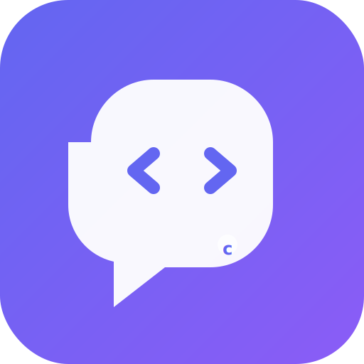

<p align="center">
  
</p>

<h2 align="center">codetalk</h2>

<p align="center">
  <strong>Maintain a living semantic map for agentic code changes.</strong><br>
  AI coding agents read it before editing, update it after changing code.
</p>

<p align="center">
  <a href="#install">Install</a> ·
  <a href="#quick-start">Quick Start</a> ·
  <a href="#cli-reference">CLI Reference</a> ·
  <a href="#how-it-works">How It Works</a>
</p>

<p align="center">
  <a href="README.md">English</a> ·
  <a href="README_CN.md">中文</a>
</p>

---

Codetalk is a CLI tool that maintains a project-local `CODEMAP.md` — a living semantic contract for AI coding agents. An agent reads the map to understand architecture, plans changes using it, then syncs the real behavior back after editing.

This is not a documentation generator. The document is not the endpoint; it is the semantic basis for the next code change.

### Why codetalk over raw LLM prompts?

| | Codetalk | Raw LLM Prompts |
|---|---|---|
| **Context persistence** | Persistent `CODEMAP.md` across sessions | Lost after every chat |
| **Parallel review** | Multi-agent coordinator + reviewers + merger | Single-shot generation |
| **Planned execution** | Plan → review → execute cycle | No structured workflow |
| **Change tracking** | Automated sync via `git` diff | Manual re-upload |
| **Cache-aware tokens** | Shows cache hit/miss per API call | Blind token consumption |

## Install

```bash
npm install -D codetalk
```

No other dependencies. Node.js 18+ required.

## Quick Start

```bash
# Initialize a semantic map
npx codetalk init

# Configure your LLM API
npx codetalk config set --api-url https://api.openai.com/v1 --api-key sk-xxx --model gpt-4.1

# Scan your codebase with parallel LLM reviewers
npx codetalk scan --write

# Ask a question about your code
npx codetalk ask "How does authentication work?" --stream

# Generate a change plan
npx codetalk plan "Add rate limiting to the API" --stream

# Execute the plan (applies file changes in parallel)
npx codetalk exec --parallel 4

# Refresh the semantic map after edits
npx codetalk sync
```

### First Run

```bash
npx codetalk init
npx codetalk config
```

Or non-interactively:

```bash
npx codetalk config set --api-url https://api.openai.com/v1 --api-key sk-xxx --model gpt-4.1
```

Config is stored at `~/.codetalker/config.json`. Environment variables are also supported:

```bash
CODETALKER_API_URL=https://api.openai.com/v1
CODETALKER_API_KEY=sk-xxx
CODETALKER_MODEL=gpt-4.1
```

## How It Works

Codetalk orchestrates multiple LLM agents per operation, each with its own progress line displayed on stderr:

```
✓ coordinator: Building file inspection plan (coordinator)...
✓ reviewer 1: 2 files reviewed
✓ reviewer 2: 1 files reviewed
✓ merger: Semantic map generated
```

In a real terminal (`isTTY`), these lines update in place. In CI or piped output, they print as plain lines on completion.

### Multi-Agent Scan

```
scan ── coordinator ──> inspection plan
         ├── reviewer 1 ──> file notes
         ├── reviewer 2 ──> file notes
         └── merger ──────> complete CODEMAP.md
```

### Plan → Execute → Sync

```
plan ──> CODEPLAN.md ──> exec ──> file changes ──> sync ──> updated CODEMAP.md
```

## CLI Reference

### Global Flags

| Flag | Description |
|------|-------------|
| `--cwd PATH` | Working directory |
| `--api-url URL` | LLM API endpoint |
| `--api-key KEY` | LLM API key |
| `--model MODEL` | LLM model name |
| `--parallel N` | Parallel agent count (default: 4) |
| `--stream` | Stream LLM response to stdout |
| `--help` | Show this guide |

### Commands

| Command | Description |
|---------|-------------|
| `init` | Create a `CODEMAP.md` template |
| `config` | Enter or view API configuration |
| `config set --api-url URL --api-key KEY [--model MODEL]` | Non-interactive config |
| `config show` | Display masked config |
| `scan [--write] [--json] [--stream] [--parallel N]` | Run parallel LLM reviewers to produce architecture semantics |
| `map` | Generate a baseline semantic map from repo structure |
| `ask "question" [--stream]` | Answer codebase questions using LLM |
| `plan "request" [--stream] [--out FILE]` | Generate an implementation plan and write to disk |
| `exec [--plan FILE] [--parallel N] [--stream]` | Execute a plan: apply file changes in parallel via LLM |
| `sync [--stream]` | Sync changes into the semantic map via LLM |
| `check` | Fail if the map is missing or stale |
| `version` | Print version and exit |

### Token Usage

After each API call, token usage is displayed on stderr:

```
[tokens] Input: ↑150 (cache hit: 30, cache miss: 120), Output: ↓50, Total: 200
```

## API Compatibility

Codetalk uses OpenAI-compatible `/chat/completions`:

```
POST {apiUrl}/chat/completions
Authorization: Bearer {apiKey}
```

Works with OpenAI, Anthropic (via proxy), Ollama (local), and any provider offering an OpenAI-compatible endpoint.

## Repository Shape

```text
codetalk/
  src/index.ts                  CLI source
  dist/index.js                 Built entrypoint
  scripts/test-cli.mjs          Smoke tests
  SKILL.md                      AI agent workflow contract
  CODEMAP.md                    This repo's semantic map
  references/repo-semantic-map.md
  references/semantic-map-template.md
```

## License

MIT
