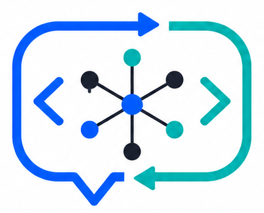

<p align="center">
  
</p>

<h2 align="center">codetalk</h2>

<p align="center">
  <strong>Maintain a living semantic map for agentic code changes.</strong><br>
  AI coding agents read it before editing, update it after changing code.
</p>

<p align="center">
  <a href="#install">Install</a> ·
  <a href="#quick-start">Quick Start</a> ·
  <a href="#cli-reference">CLI Reference</a> ·
  <a href="#how-it-works">How It Works</a>
</p>

<p align="center">
  <a href="README.md">English</a> ·
  <a href="README_CN.md">中文</a>
</p>

---

codetalk is a CLI tool that maintains a project-local `CODEMAP.md` — a living semantic contract for AI coding agents. An agent reads the map to understand architecture, plans changes using it, then syncs the real behavior back after editing.

Install globally, then run `codetalk` (or `codetalk-cli`):

```bash
npm install -g codetalk-cli
```

This is not a documentation generator. The document is not the endpoint; it is the semantic basis for the next code change.

### Why codetalk over raw LLM prompts?

| | codetalk | Raw LLM Prompts |
|---|---|---|
| **Context persistence** | Persistent `CODEMAP.md` across sessions | Lost after every chat |
| **Symbol index** | AST-based per-file indexing (Python, TS, C++, Assembly) | No code understanding |
| **Planned execution** | Plan → execute with backup, diff, validation gates | No structured workflow |
| **Change tracking** | Automated git-aware sync | Manual re-upload |
| **Cache-aware tokens** | Shows cache hit/miss per API call | Blind token consumption |
| **Safety** | Backup, path constraints, syntax gate, logic gatekeeper, rollback | No safety layer |

## Install

```bash
npm install -g codetalk-cli
```

Or use it on the fly:

```bash
npx codetalk-cli init
```

Node.js 18+ required.

## Quick Start

```bash
# 1. Initialize a semantic map for your project
codetalk init

# 2. Point it at your LLM (interactive menu, or non-interactive)
codetalk config
# or:
codetalk config set --api-url https://api.openai.com/v1 --api-key sk-xxx --model gpt-4.1

# 3. Scan and map your codebase (AST + LLM synthesis)
codetalk scan

# 4. Ask questions about your code (uses tools to explore)
codetalk ask "How does authentication work?"

# 5. Generate a plan for a change
codetalk plan "Add rate limiting"

# 6. Execute the plan — applies changes, validates, auto-syncs map
codetalk exec
```

Config is stored at `~/.codetalker/config.json`. Environment variables are also supported:

```bash
CODETALKER_API_URL=https://api.openai.com/v1
CODETALKER_API_KEY=sk-xxx
CODETALKER_MODEL=gpt-4.1
```

## How It Works

### AST-Based Scan

codetalk scan uses language-specific AST extractors (no LLM) to index symbols, skips `.gitignore`-excluded paths, then sends a compact index to the LLM for synthesis:

```
scan ── collect files ── AST extract ── symbol index ── merger (LLM) ── CODEMAP.md
                            │
              ┌─────────────┼─────────────┐
        python.ts       ts.ts        cpp.ts      asm.ts
         (ast)       (ts-morph)     (regex)     (regex)
```

Supports: Python (AST), TypeScript/JavaScript (ts-morph with regex fallback), C/C++ (regex), Assembly MASM/NASM/GAS (regex).

### Tool-Enhanced Q&A

`ask` and `plan` use a multi-turn tool-calling loop. The LLM can grep, read files, list directories, and search the symbol index before responding:

```
ask ── LLM decides → grep "class AgentSwarm" → read results → answer
     turn 1              turn 2               turn 3       done
```

### Safe Execution

Every `codetalk exec` follows a hardened safety chain:

```
plan → coordinator (LLM) → editors (parallel) → backup → syntax check
  → diff apply (git apply) → gatekeeper (LLM) → auto-sync → manifest
```

Safety features:
- **Backup** to `.codetalk/backups/<timestamp>/` with directory structure preserved
- **Git diff apply** for surgical changes (no full-file rewrite)
- **Syntax gate** for Python files (`ast.parse`)
- **Gatekeeper agent** validates program logic, retries on failure
- **Rollback**: `codetalk rollback <id>` restores files, deletes new ones
- **Timeout**: `--timeout N` (ms), default 180s

## CLI Reference

### Global Flags

| Flag | Description |
|------|-------------|
| `--cwd PATH` | Working directory |
| `--api-url URL` | LLM API endpoint |
| `--api-key KEY` | LLM API key |
| `--model MODEL` | LLM model name |
| `--timeout MS` | API request timeout (default: 180000) |
| `--parallel N` | Number of parallel workers for semantic and exec (default: 4) |
| `--help` | Show command-specific help |

### Commands

| Command | Description |
|---------|-------------|
| `init` | Create a `CODEMAP.md` template |
| `config` | Interactive provider/API configuration menu |
| `config set --api-url URL --api-key KEY [--model MODEL]` | Non-interactive config |
| `config show` | Display masked config |
| `scan [--timeout MS]` | Analyze repository with AST extraction + LLM synthesis |
| `semantic [--parallel N\|MAX] [--timeout MS]` | Extract function/method semantics using parallel LLM workers |
| `map` | Generate a baseline semantic map from repo structure |
| `ask "question"` | Answer codebase questions using tools + LLM |
| `plan "request" [--out FILE]` | Generate an implementation plan and write to disk |
| `exec [--plan FILE] [--parallel N] [--timeout MS]` | Execute a plan: apply file changes, validate, sync map |
| `check` | Fail if the map is missing or stale |
| `rollback [--list \| <id>]` | Restore files from a previous exec backup |
| `version` | Print version and exit |

### Token Usage

After each API call, token usage is displayed on stderr:

```
[tokens] Input: ↑150 (cache hit: 30, cache miss: 120), Output: ↓50, Total: 200
```

## API Compatibility

codetalk uses OpenAI-compatible `/chat/completions`:

```
POST {apiUrl}/chat/completions
Authorization: Bearer {apiKey}
```

Works with OpenAI, DeepSeek, Anthropic (via proxy), Ollama (local), and any provider offering an OpenAI-compatible endpoint.

## Repository Shape

```text
codetalk/
  src/
    index.ts          CLI entry point
    api.ts            LLM API calls + tool-calling loop
    handlers.ts       Command implementations
    panel.ts          MissionPanel (TTY progress)
    indexer.ts        Symbol index builder
    prompts.ts        All agent prompts
    tools/            6 tools (grep/read/ls/glob/stat/git_log)
    ast/              4 language extractors (python/ts/cpp/asm)
  scripts/test-cli.mjs  Smoke tests
  SKILL.md              AI agent workflow contract
  CODEMAP.md            This repo's semantic map
```

## License

MIT
